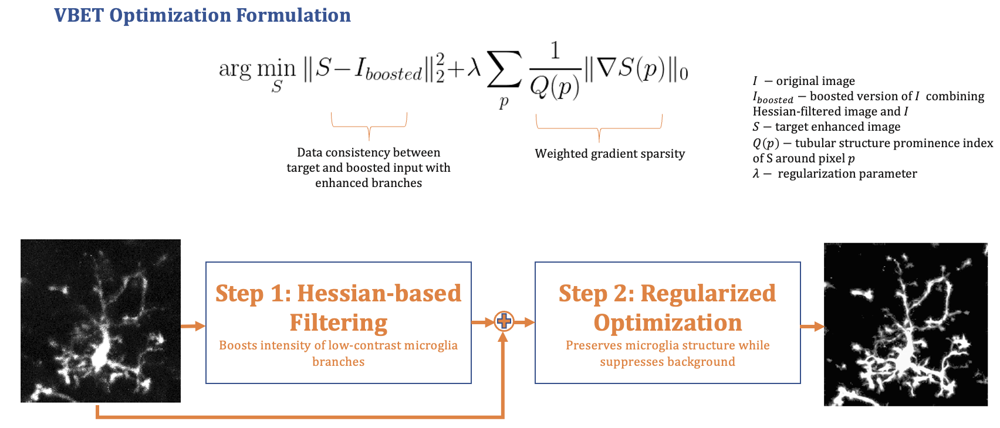

# Microscopy Image Enhancement
This repository provides a Python implementation of our work "VBET: Vesselness and Blob Enhancement Technique for 2D and 3D Microscopy Images of Microglia".
This method is designed for microscopy image enhancement of cells with joint blob-and-vessel like structures, such as microglia, astrocytes, oligodendrocyte precursor cells (OPCs), neurons, endothelial cells, and retinal Müller glia.

The proposed enhancement method works for enhancing both 2D image and 3D image stacks. To perform 2D enhancement, run 'demo_2D.py' and for 3D enhancement, run 'demo_3D.py'.

## Citation
#### T. T. Toma, K. Bisht, U. Eyo and D. S. Weller, "VBET: VESSELNESS AND BLOB ENHANCEMENT TECHNIQUE FOR 2D AND 3D MICROSCOPY IMAGES OF MICROGLIA," 2020 54th Asilomar Conference on Signals, Systems, and Computers, Pacific Grove, CA, 2020. 
